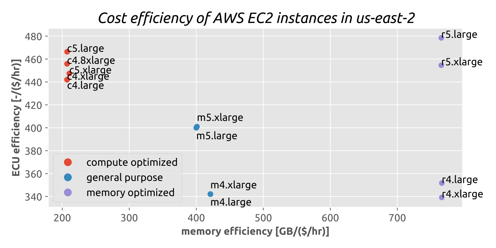
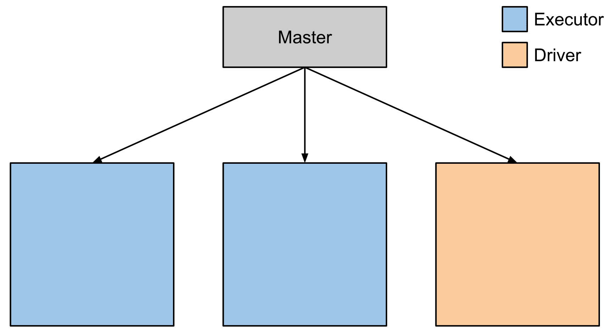
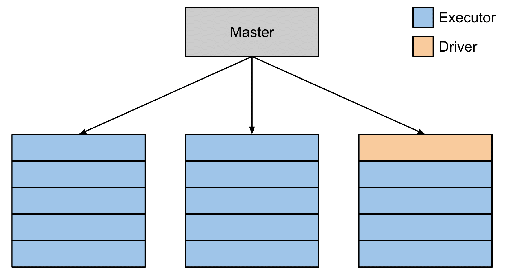
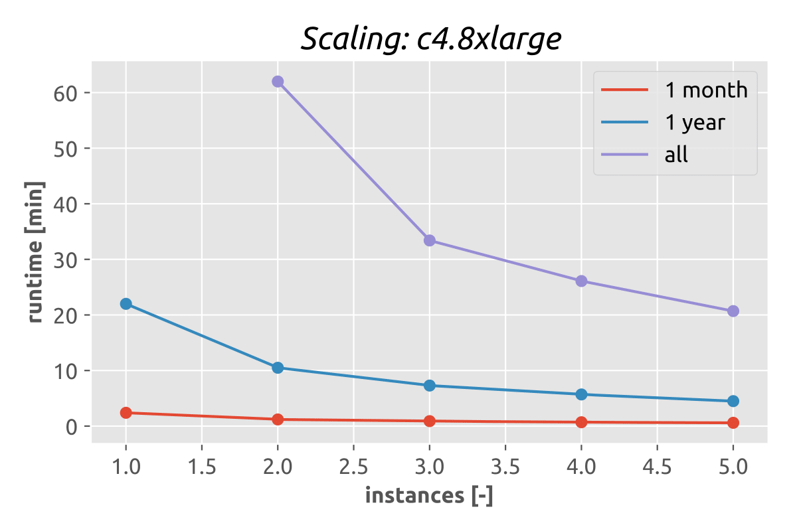
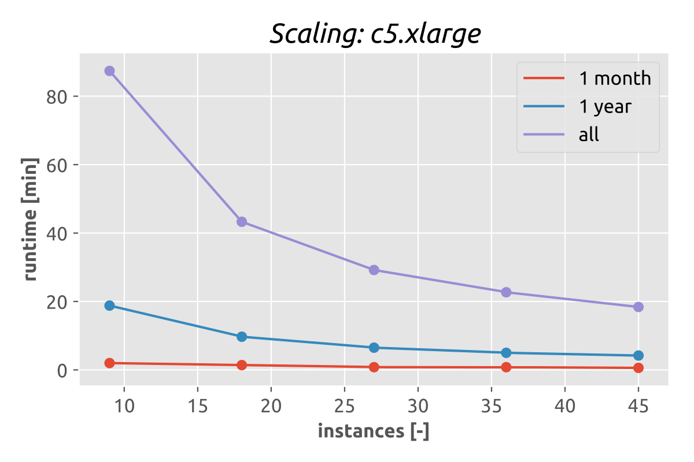
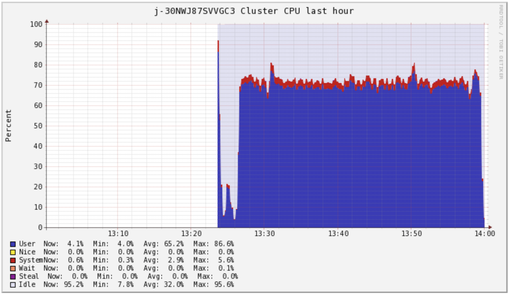
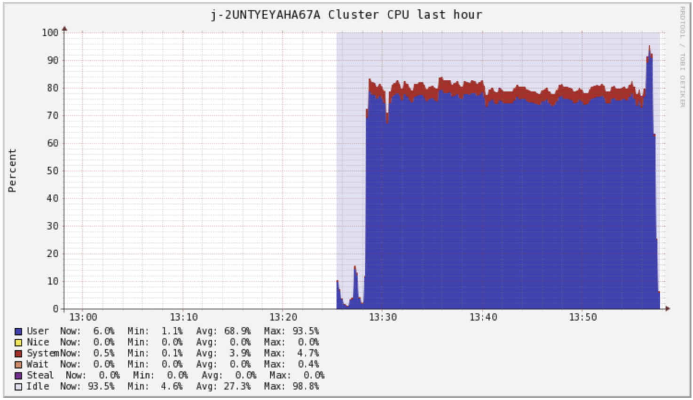
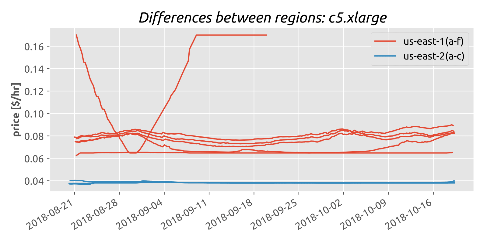

# Processing the GDELT GKG the cheap way!
**Group 24:** Olle Eriksson and Jesse Hagenaars

The [GDELT Global Knowledge Graph](https://blog.gdeltproject.org/gdelt-2-0-our-global-world-in-realtime/) (GKG) is a 3.7 TB dataset that records themes and emotions from a vast number of media sources from all over the world. In this blog post, we will be looking at how to process this huge amount of data as cost-efficient as possible, in order to come up with the ten most talked-about topics per day.

## Choosing a cost-efficient instance

Our tools of choice for processing the data will be [Apache Spark](https://spark.apache.org/) and [AWS Elastic MapReduce](https://aws.amazon.com/emr/) (EMR). Other choices, such as the type of instance to run on, are less straightforward however. Therefore, we computed the [ECU](https://aws.amazon.com/ec2/faqs/#hardware-information) and memory efficiency of various instances based on their [AWS Spot](https://aws.amazon.com/ec2/spot/) price:

It's obvious that `r5.large` should be our instance of choice, weren't it that this type is not available for EMR! The same goes for `c5.large`, while `r5.xlarge` is not available in large enough quantities (as Spot instance). So, we will be looking at `c4.8xlarge` and `c5.xlarge`.

## Tuning for maximum utilization

### Code

The many small files that comprise the GKG each take up their own partition when loaded, which might not be the most efficient way to go. Therefore, we tested the effect of using `coalesce` to merge partitions. It turned out, that coalescing to `50 * spark.default.parallelism`, where the default parallelism was set to four times the number of vCPUs, resulted in the lowest runtime for one year (804.9 GB, 30 114 files) of data.

### Instances

When running in _cluster mode_, the driver takes up one entire node by default. Such a waste! Therefore, we will use multiple, smaller executors per node. Have a look at the figure for a visual illustration.

1 executor/driver per node  |  Multiple smaller executors per node    |
|:-------------------------:|:---------------------------------------:|
| |               |

Multiple Spark and Yarn parameters have to be tweaked to achieve this. Also, we will have to be careful that all executors actually fit on the instance. A short summary of the parameters for a cluster of 3 `c4.8xlarge` and 27 `c5.xlarge` instances (both 108 vCPUs) is given in the following table:

|                                      | `c4.8xlarge` | `c5.xlarge` |
|--------------------------------------|--------------|-------------|
| Number of nodes                      | 3            | 27          |
| Total memory [GiB]                   | 180          | 216         |
| Total vCPU [-]                       | 108          | 108         |
| Total ECU [-]                        | 396          | 459         |
| Total price [$/hr]                   | 0.888        | 1.045       |
| `maximizeResourceAllocation`         | true         | true        |
| `spark.default.parallelism`          | 432          | 432         |
| `spark.executor.instances`           | 35           | 53          |
| `spark.executor.cores`               | 4            | 2           |
| `spark.executor.memory`              | 3840M        | 2560M       |
| `spark.yarn.executor.memoryOverhead` | 576M         | 512M        |
| `spark.driver.cores`                 | 3            | 2           |
| `spark.driver.memory`                | 3840M        | 2560M       |

Note that `spark.executor.cores` sets the number of threads per executor, not the number of vCPUs. Therefore, it can be any number between 1 and the number of vCPUs on a single instance.

## Scaling up!

Of course, when scaling up the configurations have to be changed. The setting `spark.default.parellelism` is set to 4 times the number vCPUs. For setups consisting of `c5.xlarge` instances, the setting `spark.executor.instances` is set to 2 times the number of instances minus 1, and for `c4.8xlarge` it is set to 12 times the number of instances minus 1. The setting `spark.executor.cores` was almost always set to twice the number of vCPUs per executor, as this resulted in nice high CPU usages of above 90%! Sometimes when trying to run the whole dataset on "small" clusters it was lowered a bit (to prevent crashes).

The figures below show how clusters consisting of `c4.8xlarge` and `c5.xlarge` scale up in terms of runtime (in minutes). 

|Scaling of `c4.8xlarge` | Scaling of `c5.xlarge`    |
|:----------------------:|:-------------------------:|
| |  |

We see that both types of instances scale as we would expect between 1 year of data and all the data. For a fixed number of instances, the ratio between the run time for the all data and 1 year of data is 4.6+/-0.1, which is the ratio betweeen the input sizes! This is not true for the ratio between 1 month and 1 year of data, the input size ratio is a bit above 10, the ratio between the run times is in [6.2, 9.4]. It is also obvious that the runtimes, for a fixed number of vCPUs and input size, are a bit in favour for `c5.xlarge` (at least for 1 year and all data). This is probably due to its slightly higher CPU usage and its newer processors. 

The tables below show the corresponding costs (in $) for these clusters. 

<table>
<tr><th> c4.8xlarge costs </th><th>c5.xlarge costs</th></tr>
<tr><td>

| Instances | vCPUs | 1 month | 1 year | All data |
|-----------|-------|---------|--------|----------|
| 1         | 36    | 0.012   | 0.114  | ?        |
| 2         | 72    | 0.012   | 0.105  | 0.620    |
| 3         | 108   | 0.013   | 0.108  | 0.495    |
| 4         | 144   | 0.014   | 0.112  | 0.513    |
| 5         | 180   | 0.015   | 0.110  | 0.507    |

</td><td>

| Instances | vCPUs | 1 month | 1 year | All data |
|-----------|-------|---------|--------|----------|
| 9         | 36    | 0.012   | 0.113  | 0.527    |
| 18        | 72    | 0.016   | 0.114  | 0.508    |
| 27        | 108   | 0.014   | 0.113  | 0.509    |
| 36        | 144   | 0.019   | 0.116  | 0.525    |
| 45        | 180   | 0.017   | 0.121  | 0.531    |

</td></tr></table>

The CPU usage of the two cheapest solutions for all data, 3 `c4.8xlarge` instances or 27 `c5.xlarge` instances, is shown below. Note that, for the larger clusters, we could get the CPU usage even higher by increasing the number of threads per executor!

CPU usage of `c4.8xlarge`   | CPU usage of `c5.xlarge`  |
|:-------------------------:|:-------------------------:|
|| |

## Picking the cheapest solution

First of all, the easiest optimization one can do is to choose the region *us-east 2*, it is offering significantly lower spot-prices than the region *us-east 1*. The figure below shows the spot-price for one instance of `c5.xlarge` during the two last months for these two regions. The price difference is obvious. Of course, there are even some price differences between the subregions (a,b etc). They might be small, but if one is optimizing for cost, why not go for the cheapest subregion as well! 

The cost for running the application on a cluster is computed as the runtime multiplied by the cost per unit time for that specific cluster setup (in the region it is located). We choose to define the time as the sum of each individual stages in Spark. Of course, there are other ways to compute the runtime, but we find this measure to be most consistent and to have the smallest rounding error.

The configuration that processes the entire GKG at the lowest cost consists of 3 `c4.8xlarge` instances, coming in at only **$ 0.495**! As we are optimizing for cost, this will be our configuration of choice.

## Things we tried that did not work

### S3 Select 
We tried using [S3 Select](https://aws.amazon.com/blogs/aws/s3-glacier-select/) which pushes data filtering operations down to the S3 system, greatly reducing the amount of data that has to be sent over the network, decreasing the transfer times. Especially when one is working with small files and is in our case just keeping two columns, this could decrease the transfer time up to fourfold. 

This, however, places some restrictions on the data, of which one is a UTF-8 encoding. Unfortunately, some GDELT GKG files contain non-UTF-8 characters, ruling S3 Select out for use.

### Kryo serialization
Spark can make use of the [Kryo serialization](https://spark.apache.org/docs/latest/tuning.html) to serialize objects more quickly, up to 10 times as fast the usual Java serialization. However, such speedups were not attained by our implementation running on any cluster. This was probably due to the use of complex classes such as `HashMap`. Even if Kryo serialization had worked, the effect would have been minimal, due to the relatively small contribution of serialization to the runtime.
 
